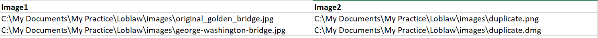
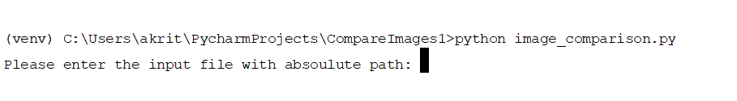
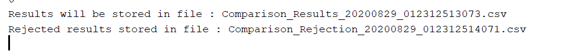
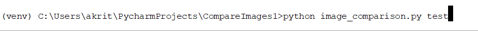
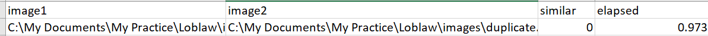

## Table of contents
* [General info](#general-info)
* [Technologies](#technologies)
* [Setup](#setup)
* [Execution](#Execution)
* [Unit Testing](#Test)
* [Output](#Output)


## General info (images-similarity-score)
This project is to find the visual similarity score between two images and the elapsed time to calculate the score . The input file will be csv file which will have 2 fields and conatin N pairs of images. Each field contains the absolute path to an image file.

### Input 



	
## Technologies
Project is created with:
* python version: 3.6
* pip version: 10.0.1

	
## Setup
To run this project, install all its dependencies locally using requirements.txt:

```
# pip install requirements.txt 

```


## Execution

* Clone this repo to your local 

* Run following command under same direcotory where repo is cloned.

```
#  python image_comparison.py 

```
* It will prompt on the screen and ask for input file with absolute path.




* Provide absoulute path to your csv file.

* After that two files will be created in the following format at the same path .

	* Comparison file with positive records 
	* Comparison file with rejected records 
	
	



## Test

To run unit test cases , just provide an argument 'test' before running the script. It is going to execute the testcases written in input.csv file under tests and generate an output file.

```
#  python image_comparison.py test

```



## Output

After the execution is completed , elapsed and similar score are calculated , Script will provide the name of an output file generated as below.



